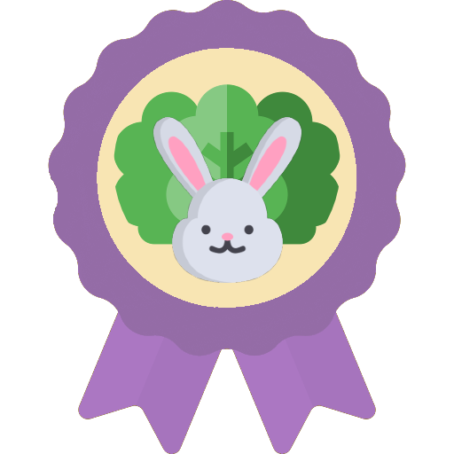

# 요리조리🍳

## 목차

- [프로젝트 소개](#프로젝트-소개)
- [텍스트 ... ](#프로젝트-소개)
- 프로젝트 명세
  - [배포 환경](#배포-환경)
  - [개발 환경](#개발-환경)
  - [Design Resources](#design-resources)
  - [핵심 라이브러리](#핵심-라이브러리)

## 프로젝트 소개

저희의 프로젝트 '요리조리'는 레시피 공유 SNS입니다.

## 프로젝트 명세

### 배포 환경

- **URL** : http://i5c205.p.ssafy.io/
- **배포 여부** : O
- **접속 가능** : 접속 가능
- **HTTPS 적용** : X
- **PORT** : // 3rd Party에서 사용하는 포트가 있다면 기입해주세요.

### 개발 환경

#### Front-end / Android

- **Framework** : Vue.js
- **지원 환경** : Web / Mobile /
- **담당자** : 송지현 / 임광훈 / 조현철

#### Back-end

- **Framework** : Spring boot
- **Database** : MariaDB
- **담당자** : 김정욱 / 류상오 / 전시영

#### Design

- Framework 사용

   : X

- **Design Tool 사용** : 

- **담당자** :  김정욱 / 류상오 / 송지현 / 임광훈 / 전시영 / 조현철

### Design Resources

**외부 템플릿 또는 에셋** (이미지 또는 링크 첨부)

- 

**자체 제작 산출물** (필요시 이미지 또는 설명 첨부)

- LOGO

  - 홈페이지 로고

    

  - 기본 로고1

    

  - 기본 로고2

    

- 칭호

||||

||||

### 핵심 라이브러리

기본 제공하는 라이브러리 외 핵심 기능 구현에 사용한 라이브러리가 있다면 작성해주세요.
 예시 ) VR/AR 라이브러리, 애니메이션 라이브러리, 텍스트/사진/동영상 지원, 편집 라이브러리 등

- 

